# Web-ohjelmoinnin jatkokurssi - Harjoitustyö

## 5G00EV06-3001 - Oskari Saarinen

Heroku [linkki](https://crypto-web-projekti.herokuapp.com)

### API

* [coincap.io](https://docs.coincap.io/) - Kryptovaluutoiden kurssi ja historia tiedot viimeisen 11 vuoden ajalta
* [live.blockcypher.com](https://live.blockcypher.com) - Lohkoketjuselain muutamalle kryptovaluutalle, kuten Bitcoin & Ethereum

### Ominaisuudet

* Kryptovaluutta selain, joka näyttää nykyisen arvon sekä historian kaavioiden avulla
* Markkina dataa, kuten kokonais arvo sekä sen historia
* Käyttäjä voi hakea valuuttoja nimen, arvon, symbolin ja muiden saatavilla olevien parametrien mukaan
* Saman tapainen kuin Coincapin omat sivut
* Mahdollisesti myös lohkoketju-selain esim. [live.blockcypher.com](https://live.blockcypher.com) API:n avulla

### Esimerkkidataa (api.coincap.io/v2/assets)

``` json
{
  "data": [
    {
      "id": "bitcoin",
      "rank": "1",
      "symbol": "BTC",
      "name": "Bitcoin",
      "supply": "18859943.0000000000000000",
      "maxSupply": "21000000.0000000000000000",
      "marketCapUsd": "1143085021117.7609228604248984",
      "volumeUsd24Hr": "19072405659.1801018324797556",
      "priceUsd": "60609.1450603939218088",
      "changePercent24Hr": "-1.4022653136332386",
      "vwap24Hr": "61306.1680433456324563",
      "explorer": "https://blockchain.info/"
    },
    {
      "id": "ethereum",
      "rank": "2",
      "symbol": "ETH",
      "name": "Ethereum",
      "supply": "118153082.1240000000000000",
      "maxSupply": null,
      "marketCapUsd": "500134012315.8456696221642043",
      "volumeUsd24Hr": "9465707405.3122993766701246",
      "priceUsd": "4232.9324239799521188",
      "changePercent24Hr": "-1.6401050436901671",
      "vwap24Hr": "4283.6456702348881211",
      "explorer": "https://etherscan.io/"
    }
  ],
  "timestamp": 1635704883653
}
```


## Release 1: 2021-11-15 features

Heroku [linkki](https://crypto-web-projekti.herokuapp.com)

* Projekti on toteutettu `TypeScript`:n avulla
* Neljä sivua, joista kahdella näkyy dummy dataa
* `React-Router` on käytössä sivujen vaihtoon
* Tyylit on toteutettu `React-Bootstrap` ja perus `Bootstrap` -kirjastoilla, sekä puhtaalla `CSS`-koodilla
* Jokaiselle APIlle on oma luokkansa, joiden avulla ladataan data verkosta ja muunnetaan `TypeScript` `interface`:ksi
* Tällä hetkellä valmiina on Assets ja Exchanges APIt ja niiden sivuilla on dummy dataa ja sivut skaalautuvat hyvin pienillekin näytöille
* Mikään sivu ei ole vielä täysin valmis UI:n puolesta, mutta muuten projekti on edistynyt hyvin
* Blockcypher lohkoketjuselain APIa ei ole vielä lisätty
* Tavoitteena on 5 työ

### Kuvia

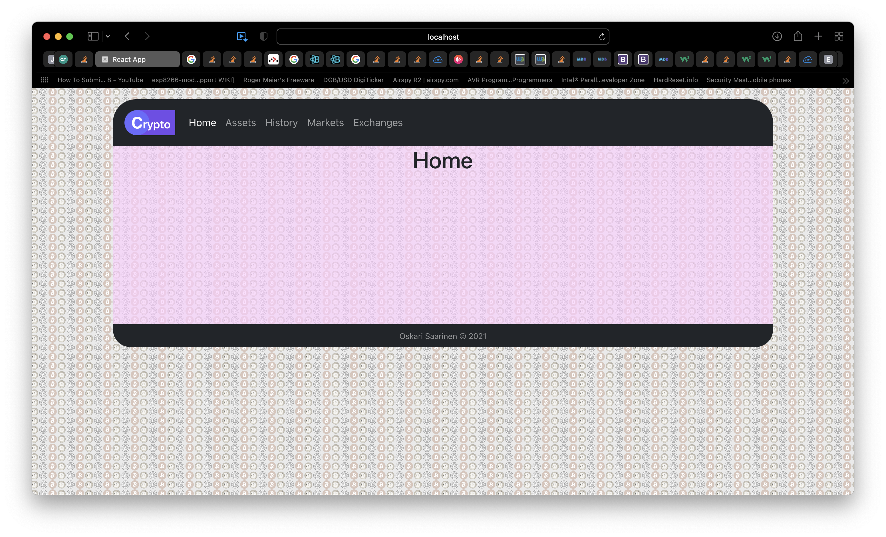
<br/>
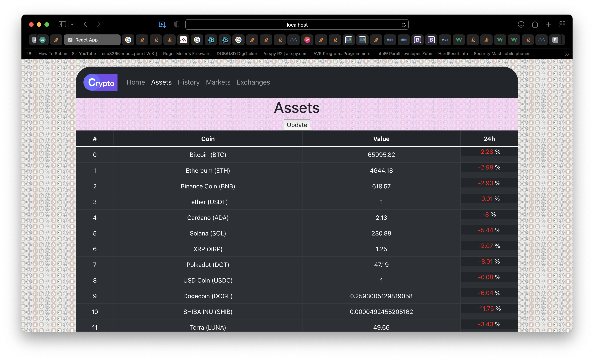
<br/>
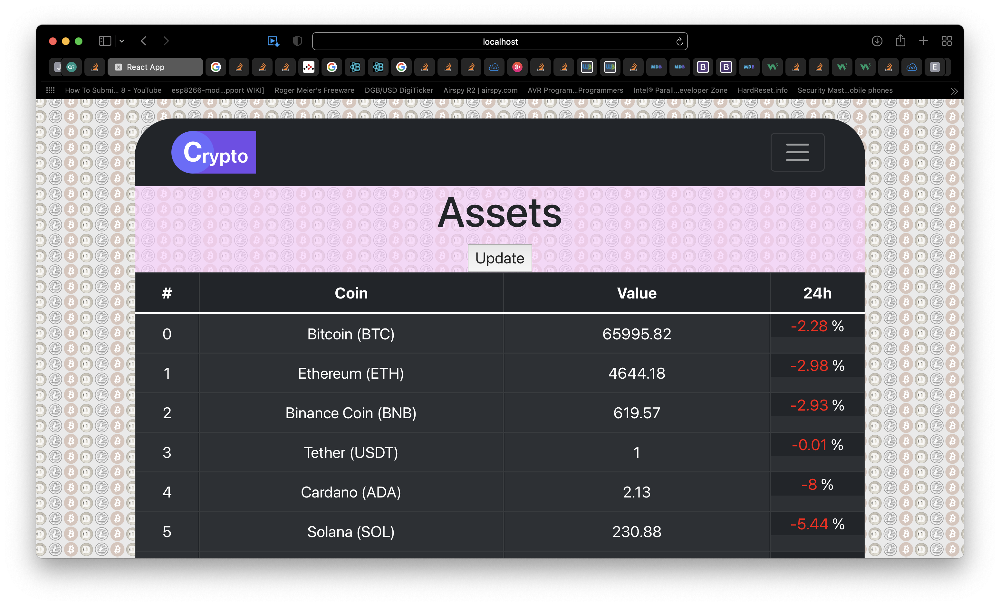
<br/>
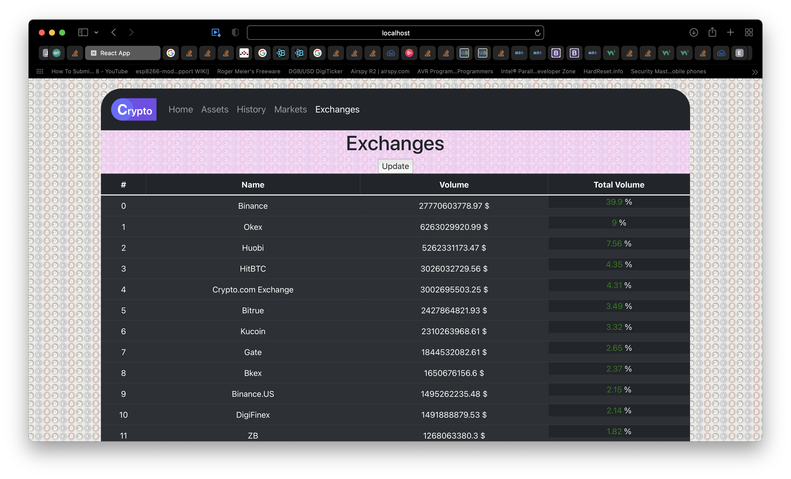
<br/>

## Release 2: 2021-11-29 features

Sovellus on valmiina [Herokussa](https://crypto-web-projekti.herokuapp.com).
Jokainen kooditiedosto on dokumentoitu ja niistä selviää koodin toiminta.

### Sivut:

* Home: Sivukartta ja tervetuloa teksti
* Assets: Lista kryptovaluutoista ja niiden dataa
* Exchanges: Lista kryptovaluutta pörsseistä ja niiden dataa
* Rates: Lista erilaisista krypto- ja fiat-valuutoista ja niiden arvo yhdysvaltain dollareissa


### Käytetyt tekniikat ja kirjastot:

* `Typescript`: [Kieli](https://www.typescriptlang.org), jolla projekti on toteutettu
* `React-Router`: Navigointi sivujen välillä ([kirjasto](https://reactrouter.com/docs/en/v6/getting-started/tutorial))
* `Echarts`: Kaavio [kirjasto](https://echarts.apache.org/en/index.html)
* `Axios`: Datan haku palvelimelta ([kirjasto](https://www.npmjs.com/package/axios))
* `React-Bootstrap`: CSS [tyylikirjasto](https://react-bootstrap.github.io) (Käytetty myös puhdasta CSS-koodia)


### Tiedostot:

`src/Components`: `JSX`-komponentit <br/>
`src/Screens`: Sivut joihin `React-Router` ohjaa <br/>
`src/api/Assets`: Assets API <br/>
`src/api/Exchanges`: Exchanges API <br/>
`src/api/Rates`: Rates API <br/>

### Kuvia:

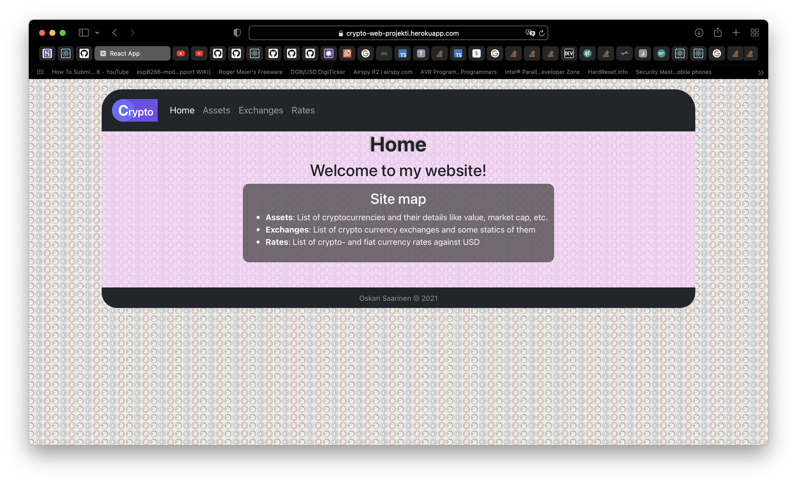
<br/>
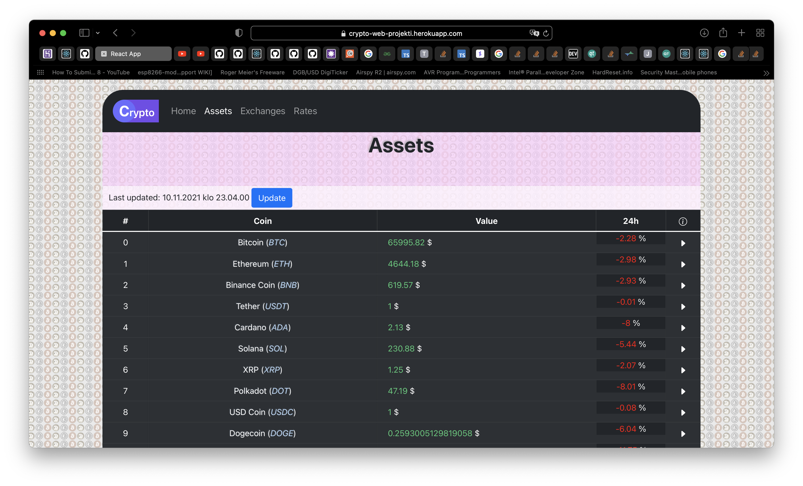
<br/>
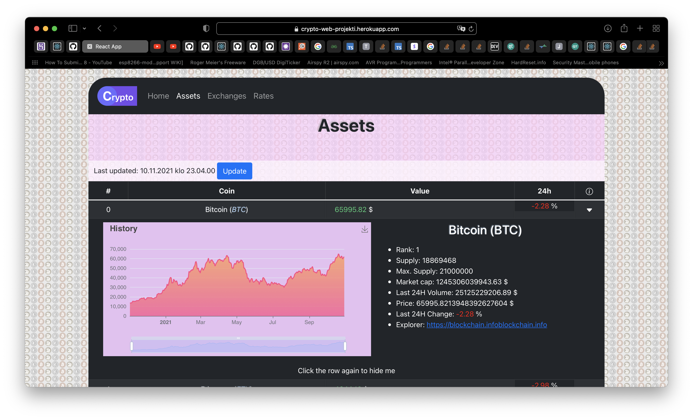
<br/>
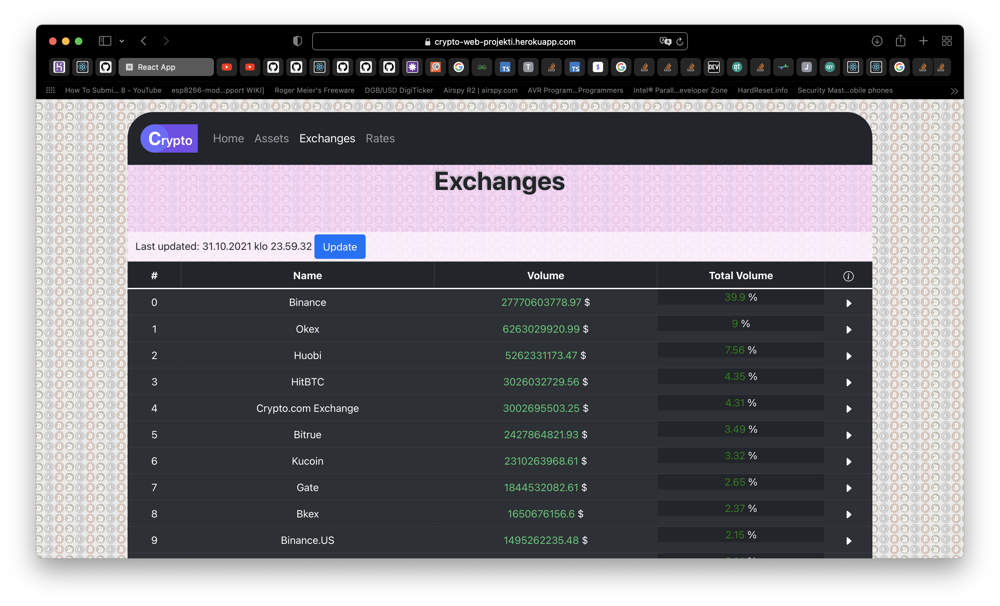
<br/>
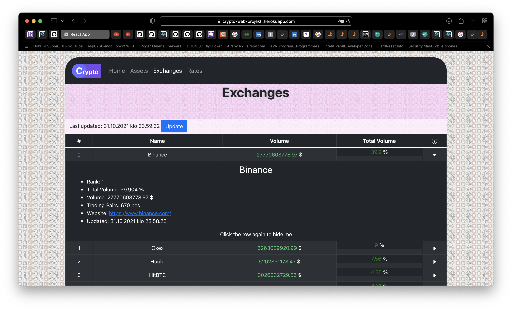
<br/>
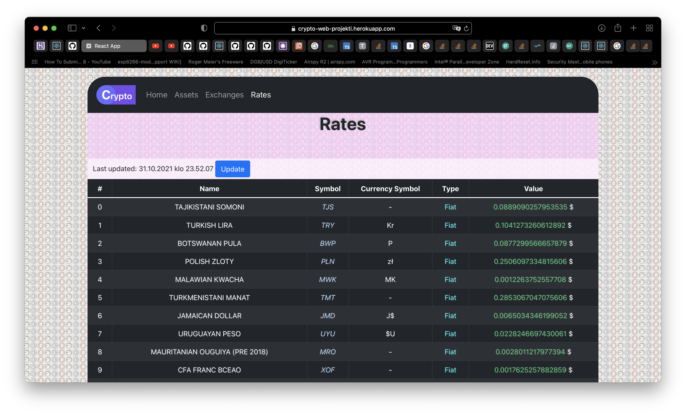
<br/>

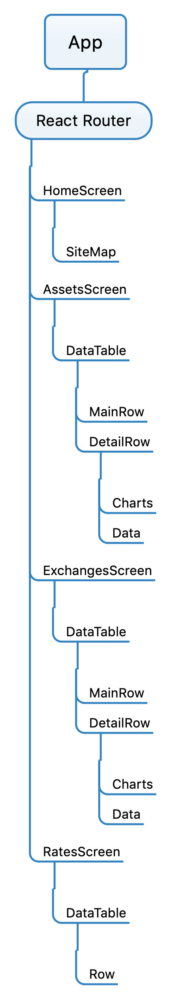
<br/>

## Known Bugs

Käytetty API on ilmainen ilman API-avainta rajoitetusti, mutta se on cors suojattu, joten lataus suoraan selaimesta ei onnistu.
Data haetaan nyt backendistä JSON-tiedostoista, mutta yritän tehdä proxyn, joka hakee datan API:sta.

* Jokin sivun osa saattaa näkyä huonosti pienemmillä näytöillä

## Screencast

Tavoitteena 5 työ

[](https://www.youtube.com/watch?v=BQ7Fzsiqxkk)

<br>
<br>


# Getting Started with Create React App

This project was bootstrapped with [Create React App](https://github.com/facebook/create-react-app).

## Available Scripts

In the project directory, you can run:

### `yarn start`

Runs the app in the development mode.\
Open [http://localhost:3000](http://localhost:3000) to view it in the browser.

The page will reload if you make edits.\
You will also see any lint errors in the console.

### `yarn test`

Launches the test runner in the interactive watch mode.\
See the section about [running tests](https://facebook.github.io/create-react-app/docs/running-tests) for more information.

### `yarn build`

Builds the app for production to the `build` folder.\
It correctly bundles React in production mode and optimizes the build for the best performance.

The build is minified and the filenames include the hashes.\
Your app is ready to be deployed!

See the section about [deployment](https://facebook.github.io/create-react-app/docs/deployment) for more information.

### `yarn eject`

**Note: this is a one-way operation. Once you `eject`, you can’t go back!**

If you aren’t satisfied with the build tool and configuration choices, you can `eject` at any time. This command will remove the single build dependency from your project.

Instead, it will copy all the configuration files and the transitive dependencies (webpack, Babel, ESLint, etc) right into your project so you have full control over them. All of the commands except `eject` will still work, but they will point to the copied scripts so you can tweak them. At this point you’re on your own.

You don’t have to ever use `eject`. The curated feature set is suitable for small and middle deployments, and you shouldn’t feel obligated to use this feature. However we understand that this tool wouldn’t be useful if you couldn’t customize it when you are ready for it.

## Learn More

You can learn more in the [Create React App documentation](https://facebook.github.io/create-react-app/docs/getting-started).

To learn React, check out the [React documentation](https://reactjs.org/).

### Code Splitting

This section has moved here: [https://facebook.github.io/create-react-app/docs/code-splitting](https://facebook.github.io/create-react-app/docs/code-splitting)

### Analyzing the Bundle Size

This section has moved here: [https://facebook.github.io/create-react-app/docs/analyzing-the-bundle-size](https://facebook.github.io/create-react-app/docs/analyzing-the-bundle-size)

### Making a Progressive Web App

This section has moved here: [https://facebook.github.io/create-react-app/docs/making-a-progressive-web-app](https://facebook.github.io/create-react-app/docs/making-a-progressive-web-app)

### Advanced Configuration

This section has moved here: [https://facebook.github.io/create-react-app/docs/advanced-configuration](https://facebook.github.io/create-react-app/docs/advanced-configuration)

### Deployment

This section has moved here: [https://facebook.github.io/create-react-app/docs/deployment](https://facebook.github.io/create-react-app/docs/deployment)

### `yarn build` fails to minify

This section has moved here: [https://facebook.github.io/create-react-app/docs/troubleshooting#npm-run-build-fails-to-minify](https://facebook.github.io/create-react-app/docs/troubleshooting#npm-run-build-fails-to-minify)
